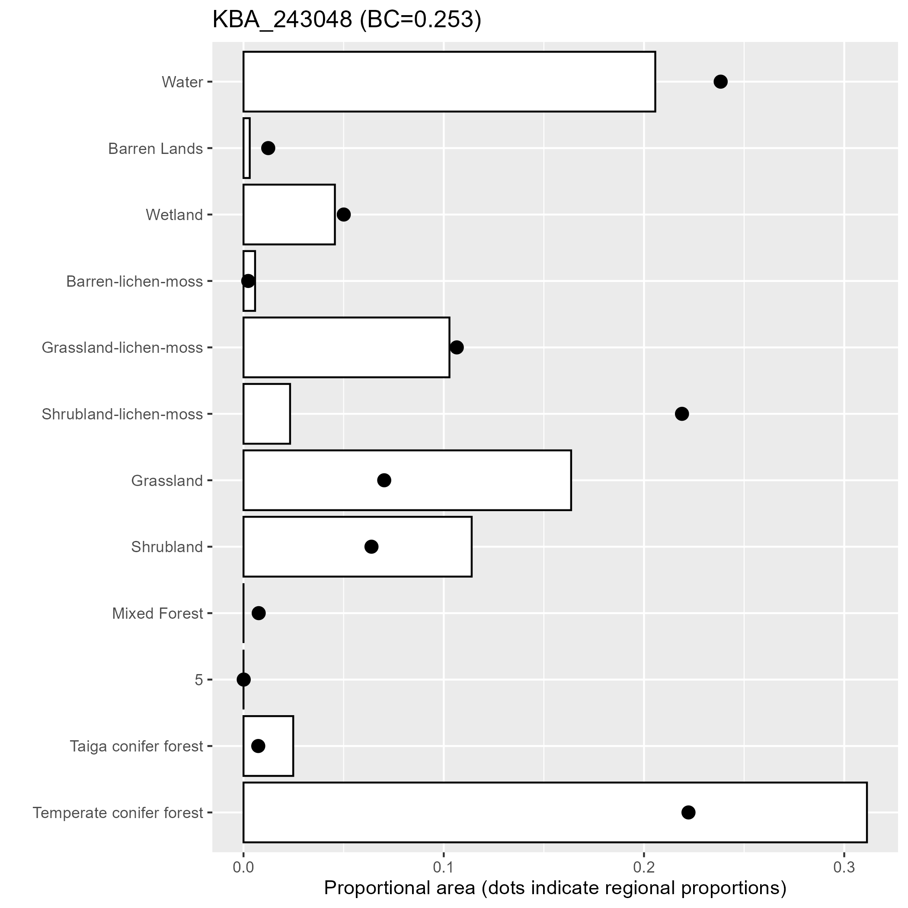

## Assess representation of KBAs and PAs

KBAs and PAs representative of the planning region and/or reference area are identified using four biophysical indicators of environmental variation, which serve as surrogates for biodiversity: soil moisture (CMI), primary productivity (GPP), lake‐edge density (LED), and land cover (LCC). These indicators are described on the **Overview - Dataset** tab. An optional fifth indicator can be used - see **Set parameter inputs**.

Representation is assessed using two dissimilarity metrics (DMs): Kolmogorov‐Smirnov (KS) for continuous indicators (CMI, GPP, LED) and Bray‐Curtis (BC) for categorical indicators (landcover or LCC). Dissimilarity metrics compare the distribution of indicators within KBAs and/or PAs against the distribution within a reference area. 

The reference area may or may not be the same as the planning region. For example, the planning region is the extent at which KBAs are identified such as an ecoregion plus intersecting FDAs (i.e., watersheds), while the reference area may be restricted to the ecoregion.

The indicator distributions are based on pixel‐level values. Both dissimilarity metrics, range from 0 to 1, where 0 is most similar and 1 is most dissimilar. The closer the two distributions are to each other, the more representative the KBA or PA is to its reference area and the lower the value of the dissimilarity metric. 

For each KBA / PA, the App produces plots of the distributions used to generate the DM (Figures 1 and 2). 
 

 

**Figure 1.** For continuous indicators (e.g., CMI), density plots show the distribution of the indicator within the KBA or PA (red) and within the reference area (blue). The Kolmogorov‐Smirnov (KS) statistic describes the dissimilarity between these distributions, and ranges in value from 0 to 1, where 0 indicates perfect proportional representation within the KBA or PA. Portions of the KBA or PA distribution (red) that fall below the blue represent values for which proportional representation was not achieved.
 

 

**Figure 2.** For categorical indicators (e.g., landcover), barplots show the proportions of each indicator class (i.e., land cover types) within the KBA or PA (bars) and within the reference area (black dots). The Bray‐Curtis (BC) statistic describes the dissimilarity between the bars and dots, and ranges in value from 0 to 1, where 0 indicates perfect proportional representation within the KBA or PA. Bars that fall below the black dots indicate that proportional representation of that class was not achieved. 
 

### Using the app

First, upload the reference area shapefile. If this shapefile was uploaded earlier under **Set input parameters** via the csv file, the shapefile does not need to be uploaded again.

**Upload reference area shapefile**

To upload the shapefile, Browse to the location of the file and select all files associated with the shapefile (.shp, .shx, .dbf, .prj, etc.) and click "Open".

Second, specify if KBAs and/or PAs are to be assessed. For PAs to be included, the PAs must first be evaluated under the **Evaluate PAs (optional)** step. 

**Assess representation using:**
- **Only KBAs** - select this option if only KBAs are to be assessed.
- **Only PAs** - select this option if only PAs are to be assessed. **See note above regarding PAs.**  
- **Both KBAs and PAs** - select this option if both KBAs and PAs are to be assessed. **See note above regarding PAs.** 

Click on the orange **Run representation analysis** button to launch the representation analysis. Depending on the number of KBAs/PAs and the resolution of the indicators, this step can take a while to finish. Once completed, a spatial layer called "KBA_att" and/or "PA_att" will be added to the KBA_analysis geopackage in the folder called "output". The attributes added to this spatial layer are listed and described below.

Once the analysis is complete, the KBAs/PAs will appear in the map. The table in the upper right provides a count of the KBAs and protected areas (PAs) in the analysis. The attributes of each KBA/PA can be explored by selecting the KBA/PA from the dropdown menu. When selected, the KBA/PA and its upstream area will be highlighted in the map. 

**Table Attributes:**
- Area km2: area of KBA/PA in km2   
- AWI: mean catchment area-weighted intactness of the KBA/PA (%)
- Upstream Area km2: area upstream of the KBA/PA in km2 
- Upstream AWI: mean catchment area-weighted intactness of the upstream area (%)
- DCI: Dendritic Connectivity Index
- CMI: KS statistic for Climate Moisture Index
- GPP: KS statistic for Gross Primary Productivity
- LED: KS statistic for lake-edge density
- LCC: BC statistic for landcover

**Filter KBAs and/or PAs based on dissimilarity metrics (DMs) and upstream area**

To explore the results, use the sliders to set maximum DM values for each indicator and the maximum upstream area for the KBA/PA. Click on the orange **Apply filtering** button. The table on the upper right will update and the KBAs/PAs available for exploration, and displayed on the map, will be restricted to the filtered KBAs/PAs. No new spatial layers are created.

**Interacting with the Map**

Click on the icon in the top right corner of the map to view the full list of spatial layers available to turn on and off on the map.

## Output

If KBAs are include in the representation analysis, a spatial layer called "KBAs_att" is added to the "KBA_analysis" geopackage (KBA_analysis.gpkg) in the "output" subfolder. 

**KBAs_att** - KBA polygons with the following attributes:

- **Network** is the unique identifier for the KBA.  
- **AWI** is the mean area-weighted catchment intactness of the KBA reported as a proportion, ranging from 0 (0% intact) to 1 (100% intact).  
- **area_km2** is the area of the KBA in km2.  
- **up_km2** is the total area upstream of the KBA in km2.  
- **up_AWI** is the mean area-weighted catchment intactness of the area upstream of the KBA reported as a proportion, ranging from 0 (0% intact) to 1 (100% intact).  
- **dci** is the Dendritic Connectivity Index (DCI) of the KBA.
- **cmi** is the KS statistic measuring the KBA's representation of CMI.
- **led** is the KS statistic measuring the KBA's representation of LED.
- **gpp** is the KS statistic measuring the KBA's representation of GPP.
- **lcc** is the KS statistic measuring the KBA's representation of landcover. 

If PAs are include in the representation analysis, a spatial layer called "PAs_att" is added to the "KBA_analysis" geopackage (KBA_analysis.gpkg) in the "output" subfolder. 

**PAs_att** - PA polygons with the following attributes:

- **Network** is the unique identifier for the PA.  
- **AWI** is the mean area-weighted catchment intactness of the KBA reported as a proportion, ranging from 0 (0% intact) to 1 (100% intact).  
- **area_km2** is the area of the KBA in km2.  
- **up_km2** is the total area upstream of the KBA in km2.  
- **up_AWI** is the mean area-weighted catchment intactness of the area upstream of the KBA reported as a proportion, ranging from 0 (0% intact) to 1 (100% intact).  
- **dci** is the Dendritic Connectivity Index (DCI) of the KBA.
- **cmi** is the KS statistic measuring the KBA's representation of CMI.
- **led** is the KS statistic measuring the KBA's representation of LED.
- **gpp** is the KS statistic measuring the KBA's representation of GPP.
- **lcc** is the KS statistic measuring the KBA's representation of landcover. 
