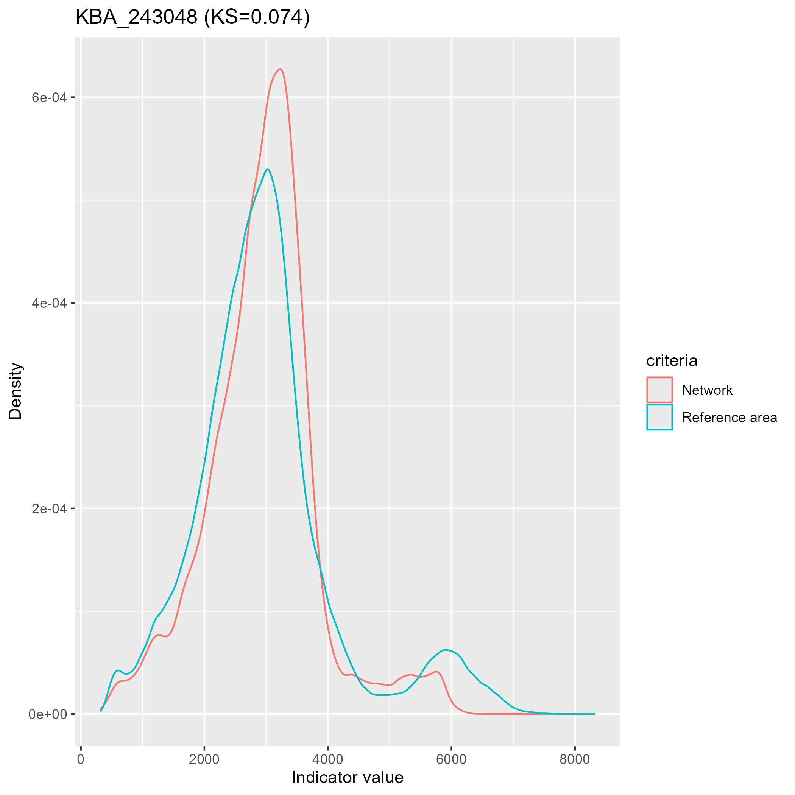

## Assess representation of KBAs and PAs

KBAs and PAs are assessed on how well they represent the environmental variation of a **reference area**, using four indicators that serve 
as surrogates for biodiversity: climate moisture (CMI), gross primary productivity (GPP), lake-edge density (LED) and land cover (LCC). 
An optional fifth, custom indicator can be added in **Set input parameters**. See the **Dataset Requirements** tab for descriptions.

The reference area may differ from the planning region. For example, KBAs may be built within an ecoregion plus its intersecting watersheds (planning region), 
while representation is measured against the ecoregion only (reference area).

### Dissimilarity metrics (DMs)
For each indicator, the distribution of pixel values within a KBA or PA is compared with the distribution within the reference area:
- **Kolmogorov–Smirnov (KS)** for continuous indicators (CMI, GPP, LED and the custom indicator)
- **Bray–Curtis (BC)** for land cover (LCC)

Both range from **0** (identical distributions, perfect proportional representation) to **1** (completely different). The lower the value,
the more representative the KBA or PA.

 

 

**Figure 1.** For continuous indicators (e.g., CMI), density plots show the distribution of the indicator within the KBA or PA (red) and within the reference area (blue). The Kolmogorov‐Smirnov (KS) statistic describes the dissimilarity between these distributions, and ranges in value from 0 to 1, where 0 indicates perfect proportional representation within the KBA or PA. Portions of the KBA or PA distribution (red) that fall below the blue represent values for which proportional representation was not achieved.

 

 

**Figure 2.** For categorical indicators (e.g., landcover), barplots show the proportions of each indicator class (i.e., land cover types) within the KBA or PA (bars) and within the reference area (black dots). The Bray‐Curtis (BC) statistic describes the dissimilarity between the bars and dots, and ranges in value from 0 to 1, where 0 indicates perfect proportional representation within the KBA or PA. Bars that fall below the black dots indicate that proportional representation of that class was not achieved. 

 

### Using the app

1. **Select the potential KBAs layer**: `KBAs_reducedFALSE` (all KBAs) or a saved reduction such as `KBAs_reduced10000`.
2. **Reference area**: upload it here if it was not provided in **Set input parameters**. Select all of the shapefile's
files (`.shp`, `.shx`, `.dbf`, `.prj`).
3. **Assess representation using**: **Only KBAs**, **Only PAs** or **Both KBAs and PAs**. The PA options are greyed out when no protected
areas were provided in **Set input parameters**.
4. Click **Run representation analysis**. The app:
   - clips each indicator raster to the reference area (done once per project)
   - calculates the DMs for every KBA and/or PA, with a progress bar
   - displays the indicator rasters and their legends on the map (toggle them in the layer control, top right)

   This can take a while, depending on the number of KBAs/PAs and the raster resolution. Results already calculated for the same layer are reloaded instead of recalculated.

5. **Explore**: choose a KBA or PA in **Select KBAs/PAs** (top right). It is highlighted on the map with its upstream area, a summary table 
is shown, and the indicator plots appear below the map. Click the expand icon to enlarge a plot.
6. **Filter**: set the maximum DM for each indicator, the **maximum upstream area** and the **minimum PA area** (applies to PAs only), 
then click **Apply filtering**. The map, counts table and **Select KBAs/PAs** list are restricted to the KBAs/PAs that pass all thresholds.
7. **Download Filtered KBAs**: saves the filtered set to the GeoPackage and copies its plots (see Output).

 

### Summary table
| Variable | Description |
|---|---|
| Area km2 | Area of the KBA/PA |
| AWI (%) | Area-weighted intactness of the KBA/PA |
| Upstream area km2 | Area upstream of the KBA/PA |
| Upstream AWI (%) | Area-weighted intactness of the upstream area |
| DCI | Dendritic Connectivity Index (0–1) 0 = fragmented, 1 = fully connected stream network within the KBA (Cote et al. 2009) |
| CMI, GPP, LED, *custom* | KS statistic (0–1) 0 = low dissimilarity or high representation, 1 = high dissimilarity or low representation | 
| LCC | BC statistic (0–1)  0 = low dissimilarity or high representation, 1 = high dissimilarity or low representation |

 

### Output
In `output/KBA_analysis.gpkg`:
- `repKBAs_reduced<grid>`: KBAs with DMs (Only KBAs or Both)
- `repPAs`: PAs with DMs (Only PAs or Both)
- `repKBAPAs_reduced<grid>`: KBAs and PAs combined (Both)
- Filtered sets saved with **Download**, named after the thresholds, e.g. `repKBAs_reduced10000_up25000_cmi0.2_gpp0.2_led0.2_lcc0.2`

Attributes: `network`, `area_km2`, `AWI`, `up_km2`, `up_AWI`, `dci`, `cmi`, `gpp`, `led`, `lcc` and the custom indicator, if used.

In the `output` folder:
- `kba_cmi.tif`, `kba_gpp.tif`, `kba_led.tif`, `kba_lcc.tif` (+ `_4326` display versions): indicator rasters clipped to the reference area
- `plot/<layer name>/<indicator>/<KBA or PA>.png`: distribution plots for each KBA/PA

&nbsp;

&#x1F4CC; **Note:** Clipped rasters and representation layers are reused when the project is reopened. If you change the reference area or the indicators, delete them first so they are recalculated.

