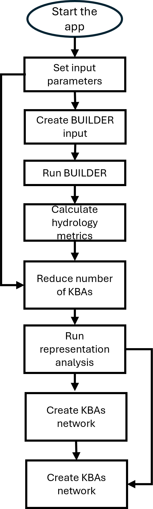
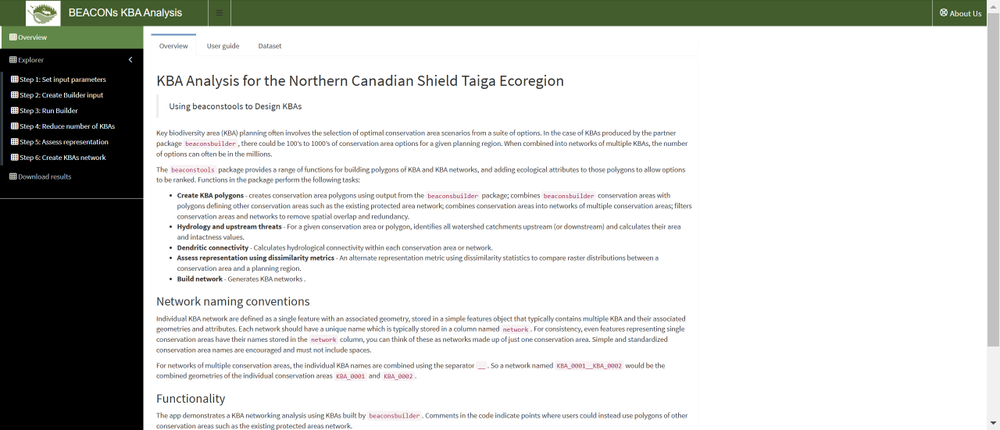
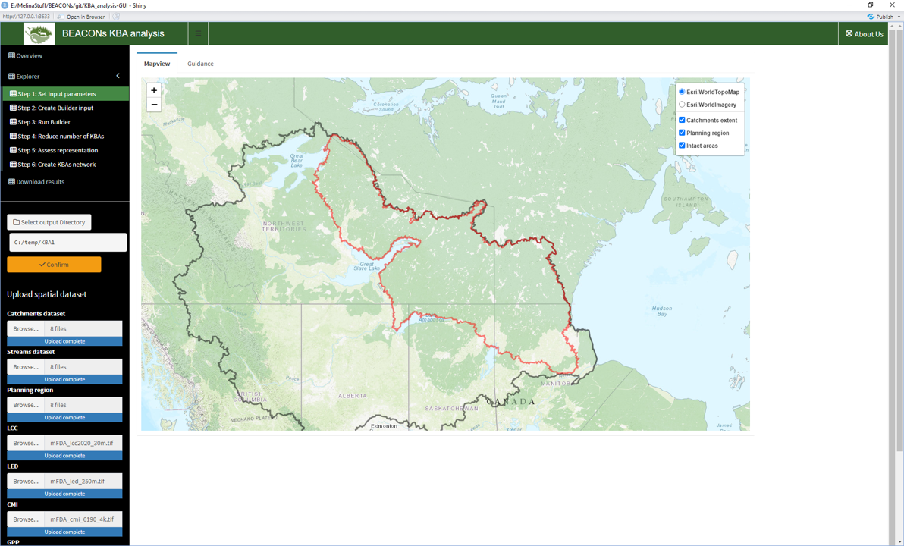
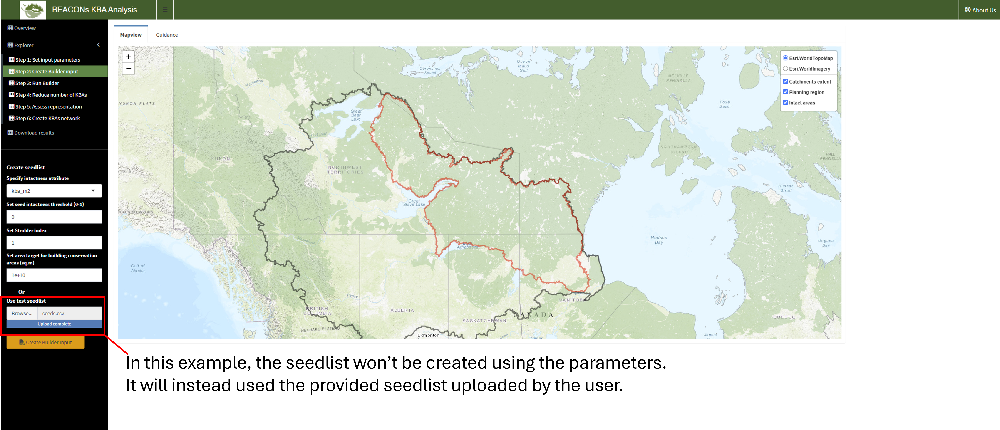
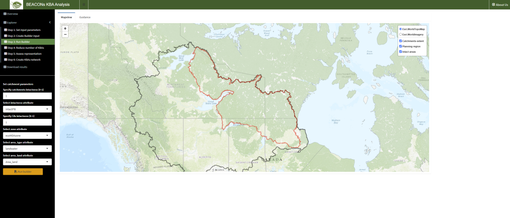
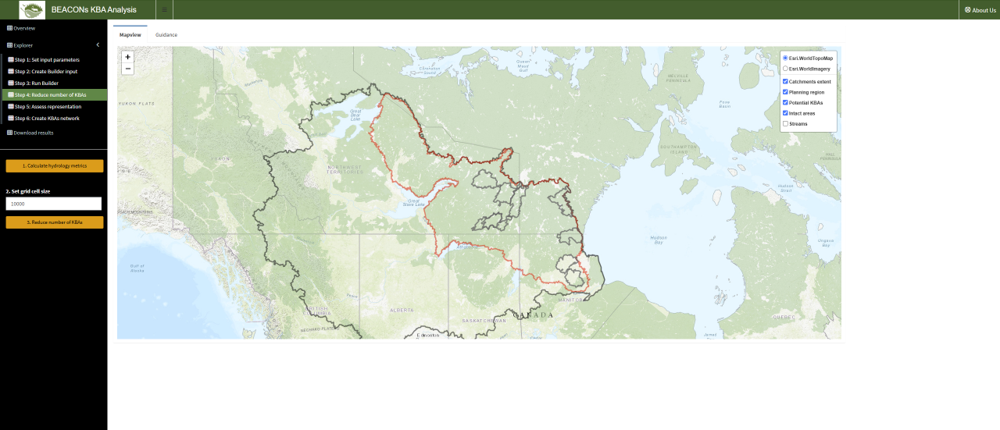

## Workflow
TEST TEST TEST
The following workflow demonstrates a conservation area networking analysis using conservation areas built by `beaconsbuilder`. Comments in the code indicate points where users could instead use polygons of other conservation areas such as the existing protected areas network.

## Overview

The Overview section provides a description of the app and its functionality. 

 Figure 1. Shiny-based BEACONs KBA Analysis app.

## Set input parameters

Click on "Step 1 - Set input parameters" to start the app. Select an output directory. If you previously used the selected output directory to run the app, existing output will be loaded in the environment. The app doesn't allow overwrite. If the current analysis requires a different set of parameters from the previous one, please select an empty output directory. 

Upload required shapefiles (catchments, streams and planning region shapefiles). Shapefile need the following files:

.shp – The main file containing the geometric data (points, lines, or polygons).
.shx – The index file, which helps in fast access to the geometries.
.dbf – The attribute data file, which stores the attribute data (e.g., fields in a table corresponding to the geometries).
.prj – The projection file, which contains the coordinate system information.

If you previously ran the representation analysis using the selected output directories, criteria (CMI, GPP, LED, LCC and custom criterion) don't need to be uploaded. A cached version of the clipped TIFF files from the last analysis will be used. 

 Figure 2. Set input parameters.

## Create Builder input

The "Step 2 - Create Builder Input" tab consists to generate the neighbour and seedlist tables derived from the catchments shapefile provided. You have two choices:

  - Set the parameters required (column representing intactness in the uploaded catchments shapefile, the intactness threshold and the Strahler index value to applied and the area targeted for building KBAs) by the tool to create the seedlist from the uploaded catchments shapefile. Fields are by default autofill, but can be changed to fulfill user specific need.

  - Upload a custom seedlist associated to the catchments shapefile provided. The file needs to be a .csv. 

 Figure 3. Create Builder Input.

### Run Builder

The "Step 3 - Run Builder" tab consists to run Builder and from which the KBAs will be generated. 

 Figure 4. Run Builder.

### Reduce numbers of KBAs

The "Step 4 - Reduce numbers of KBAs" tab consists to calculate hydrology metrics for each KBA generated by builder and to reduce the number of KBAs using a predetermined grid cell size. KBAs will then be dispalyed on the map. 

 Figure 5. KBAs generated by Builder once the number has been reduced using predefined grid cell size.

### Run representation analysis

The "Step 5 - Run representation analysis" tab consists to calculate dissimilarity metrics for each KBA using the criteria that were previously uploaded. Dissimilarity metrics range from 0 (low dissimilarity) to 1 (high dissimilarity). You can then filter KBAs based on a  criteria specific threshold and then map individual KBA with their respective upstream areas. The selection of an individual KBA populates the statistics panel to display results on intactness, upstream area, dendritic connectivity and dissimilarity metrics. 

 Figure 6. Run representation analysis.

### Create KBAs network

The "Step 6 - Create KBAs network" tab consists to create KBAs network by setting the number of KBAs per network and confirm if network would be only composed of selected KBAs that reached the criteria threshold previously applied. The dissimilarity metrics then run at the network level. To visualize each network, the user can then apply a threshold on each criterion. The selection of a network populates the statistics panel to display results on intactness, upstream area, dendritic connectivity and dissimilarity metrics.

 Figure 7. Create KBAs network.

